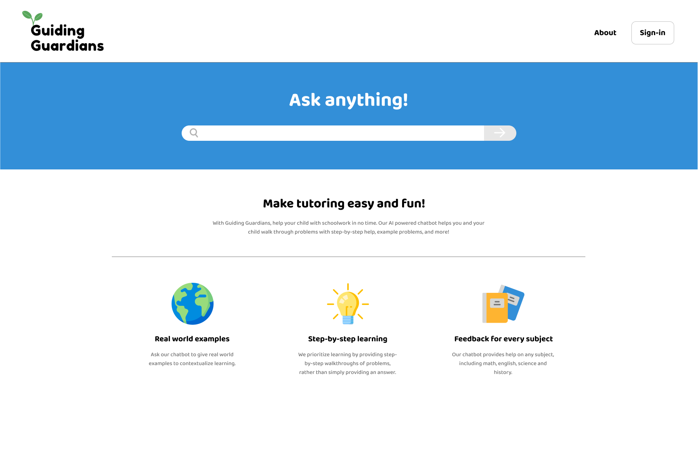

[GuidingGuardians](https://guidingguardians.netlify.app "Guiding Guardians - Live Site")
---------------------

We are an AI-powered chatbot designed to assist parents, guardians, sitters, and tutors in supporting their children with homework and academic tasks. Our mission is to make learning a collaborative and enjoyable experience for both parents and students. At Guiding Guardians, we understand the challenges parents face when it comes to helping their children with homework. The ever-changing educational landscape, complex subject matter, and busy schedules can make it difficult to provide the necessary guidance and support. That's where we come in. Our chatbot leverages the power of artificial intelligence to simplify the process and empower!

## Technologies Used
* NextJS
* ReactJS
* TypeScript
* Node
* TailWind CSS
* CSS
* Netlify

## IceBox

- [ ] Refactor Styling
- [ ] Change Style for Calories Remaining if Below 0
- [ ] Fix flex styling
